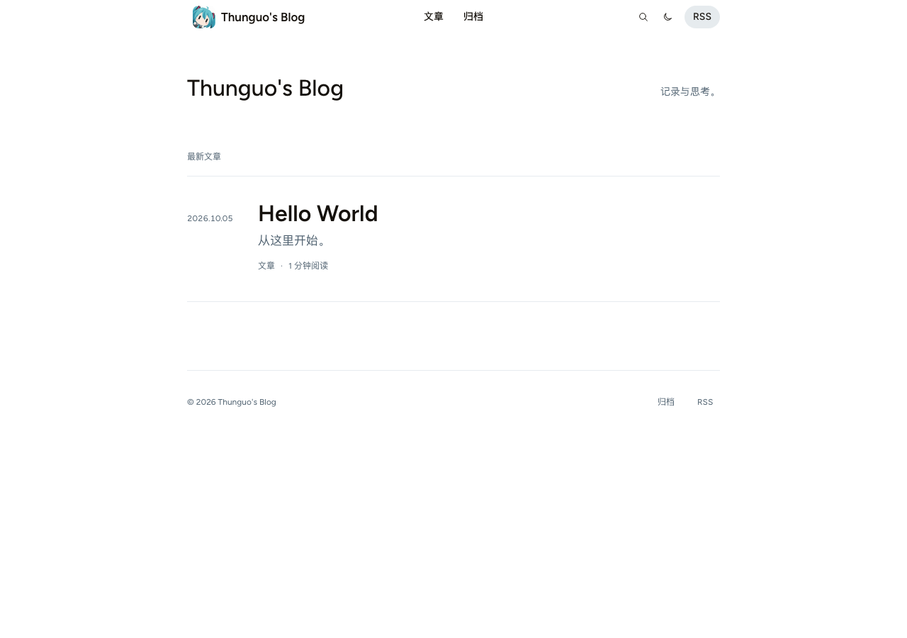
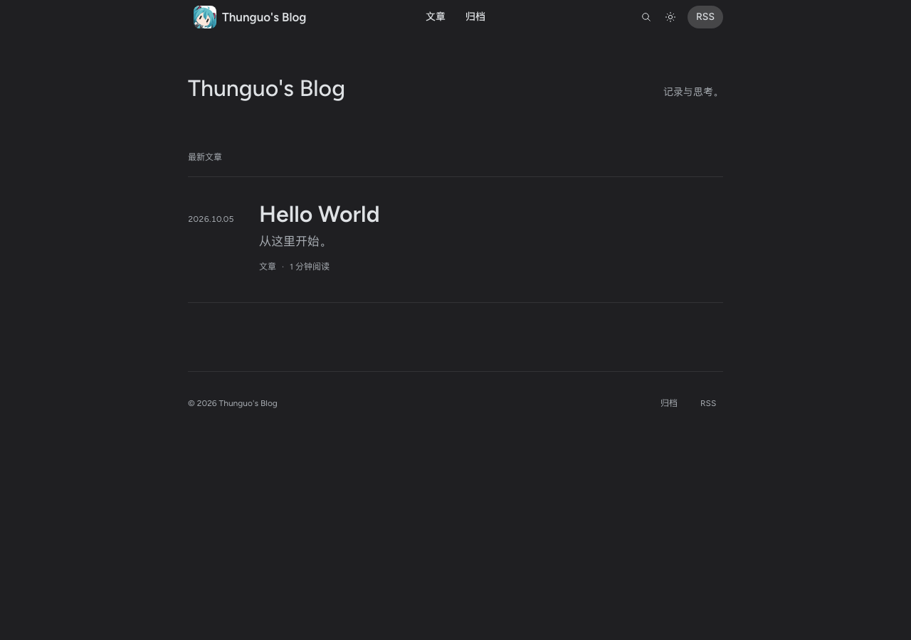
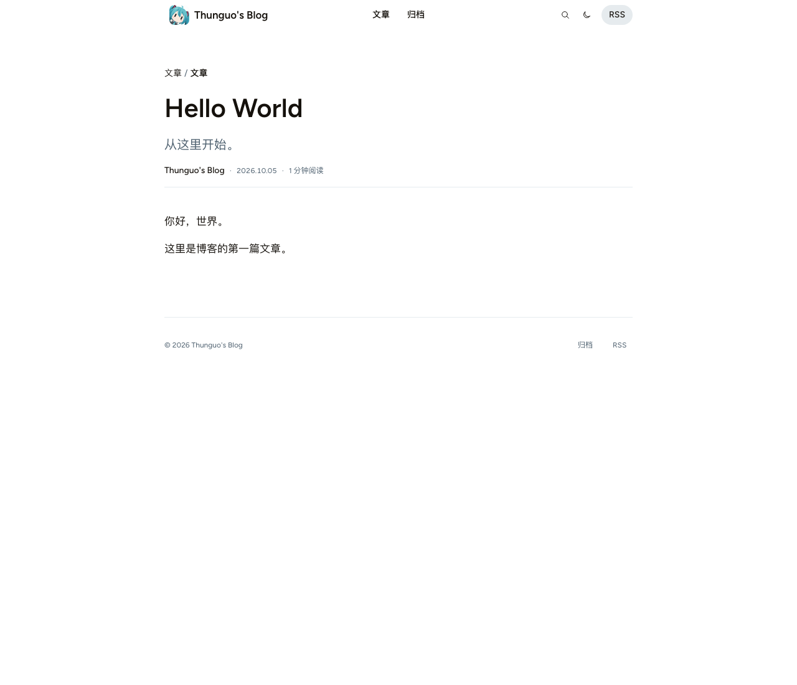
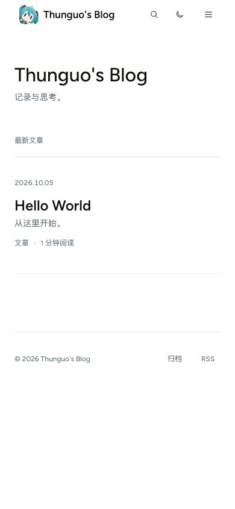
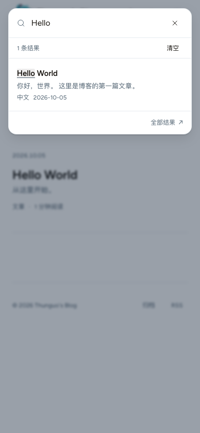

# Hugo Astryx Theme

**English** · [简体中文](README_CN.md)

[Introduction](#introduction) · [Screenshots](#screenshots) · [Quick start](#installation) · [Configuration](#configuration) · [Development](#development)

## Introduction

A quiet Hugo blog theme built with real [Astryx](https://astryx.atmeta.com/) components and the visual language of its official website. Figtree typography, generous spacing and neutral surfaces keep the focus on writing, with light and dark appearances.

- Chinese and English articles in one chronological feed, with optional translation links.
- Responsive navigation, live full-text search, article outlines and a photography layout.
- Reading links with clear footnote returns, and image previews that preserve your place.
- Hugo Chroma highlighting, language labels, filenames, line numbers and code copying.
- Mathematical formulas rendered at build time, with self-hosted styles and fonts.
- Optional [giscus](https://giscus.app/) comments styled to match the theme.
- Prebuilt assets and self-hosted fonts; everyday use requires only Hugo.

This is an independent adaptation, not an official Meta theme. See [NOTICE](NOTICE) for the upstream sources and licenses. This repository also works as a ready-to-deploy blog: it includes one Hello World article and a GitHub Pages workflow.

## Screenshots

Actual screenshots of the bundled blog, with its single Hello World article.



<details>
<summary>Dark mode, article layout, mobile view and search</summary>

| Dark mode | Article layout |
| --- | --- |
|  |  |

| Mobile view | Search |
| --- | --- |
|  |  |

</details>

## Installation

### Fork and publish on GitHub Pages

You can complete setup entirely on GitHub; no local tools or custom secrets are required.

1. [Fork this repository](https://github.com/thunguo/hugo-astryx-theme/fork) and name your public repository `<your-lowercase-username>.github.io` for a personal homepage. A different name also works as a project site at `https://<username>.github.io/<repository>/`.
2. Open **Actions** in your fork and enable workflows if prompted.
3. In **Settings > Pages > Build and deployment**, set **Source** to **GitHub Actions**. These repository settings do not come with a fork.
4. Edit `title` near the top of [blog.toml](blog.toml). Replace [assets/images/logo.jpg](assets/images/logo.jpg), or change `params.astryx.logo` to your own image path. Commit your changes to the default branch.
5. Wait for the **GitHub Pages** workflow to finish. Its deployment summary links to your published blog. If you changed Pages settings after committing, use **Actions > GitHub Pages > Run workflow**.

The workflow builds with Hugo **0.167.0**, using the committed Astryx assets. It takes the public URL from GitHub Pages, so `baseURL` need not be edited for this setup. Every subsequent commit to the default branch publishes automatically; pull requests are built for validation and do not deploy.

The starter contains only one article: [content/posts/hello-world.md](content/posts/hello-world.md). Edit it or delete it when you add your writing. Search and archive index files are utility pages, not additional posts. Comments stay off until you configure your own giscus repository.

### Local preview and writing

Install [Hugo](https://gohugo.io/installation/) **0.146.0 or later**. Node.js, pnpm, Go and Hugo Extended are not required for normal blogging.

```sh
git clone https://github.com/thunguo/hugo-astryx-theme.git
cd hugo-astryx-theme
hugo server --config hugo.toml,blog.toml -D
```

Clone your fork instead of the upstream URL when writing your own blog. Open the address printed by Hugo, usually `http://localhost:1313/`. `-D` includes drafts in the preview.

```sh
hugo new content posts/my-first-post.md --config hugo.toml,blog.toml
hugo --config hugo.toml,blog.toml --minify
```

The archetype starts with `draft: true`; set it to `false` to publish. Production builds exclude drafts and future-dated posts. The output is `public/`, which stays out of Git. For another hosting service, set `baseURL` in `blog.toml` to your public address or pass `--baseURL` at build time.

The two configuration files have separate jobs: `hugo.toml` provides theme defaults, while `blog.toml` holds your site identity, navigation and comment settings. Do not add `theme` or a parent-directory `themesDir` to the bundled blog; it uses this repository's templates directly and works regardless of the checkout folder name.

### Use the theme in an existing Hugo site

Copy only the reusable theme files from a downloaded checkout into your site's `themes/hugo-astryx-theme/`:

```sh
mkdir -p themes/hugo-astryx-theme
cp -R /path/to/hugo-astryx-theme/assets /path/to/hugo-astryx-theme/layouts \
  /path/to/hugo-astryx-theme/static /path/to/hugo-astryx-theme/i18n \
  /path/to/hugo-astryx-theme/archetypes themes/hugo-astryx-theme/
cp /path/to/hugo-astryx-theme/hugo.toml /path/to/hugo-astryx-theme/theme.toml \
  /path/to/hugo-astryx-theme/LICENSE /path/to/hugo-astryx-theme/NOTICE \
  /path/to/hugo-astryx-theme/THIRD_PARTY_LICENSES.txt themes/hugo-astryx-theme/
```

Replace `/path/to/hugo-astryx-theme` with your checkout path. Copying the same files manually also works. Do not copy the starter's `content/`, `blog.toml`, development dependencies or build output into the theme directory. Then set `theme = 'hugo-astryx-theme'` in your site's configuration, using [blog.toml](blog.toml) as a reference for your own site settings. Keep your existing content and configure [search and archive pages](#content-and-navigation) if desired.

## Configuration

### Site settings

Edit [blog.toml](blog.toml) for the bundled blog, or your own site's Hugo configuration when installing the theme separately. `title` controls the navigation, browser title and homepage heading. An optional `params.astryx.intro` overrides only the homepage heading. Theme options belong under `[params.astryx]`:

| Option | Type | Default | Purpose |
| --- | --- | --- | --- |
| `uiLocale` | string | Hugo site language | Astryx control locale; use `en-US` or `zh-CN` and align it with the site language. |
| `intro` | string | site title | Optional homepage heading override. |
| `description` | string | unset | Homepage introduction; page metadata can fall back to Hugo's `params.description`. |
| `logo` | string | default Astryx mark | Image path or URL for the navigation logo and, when configured, favicon. |
| `mainSections` | string array | `['posts']` | Sections included in the homepage, archive and home RSS feed. |
| `showToc` | boolean | `true` | Include a collapsible article outline, initially closed. |
| `defaultMode` | string | `system` | Initial appearance: `system`, `light` or `dark`. A saved reader preference takes precedence. |
| `coverFallback` | string | unset | Set to `art` to generate Astryx pattern covers for posts without an image. |
| `postTypes` | string map | empty | Custom display labels for article types. |

Set the default author in `[params.astryx.author]` with `name = 'Your Name'`. Leave it empty to use the repository owner during GitHub Pages builds, or the site title locally. It supplies article bylines, the footer, author metadata and RSS creators. An article's `author` overrides its byline, structured metadata and RSS creator.

For a personal logo, put an image at `assets/images/logo.jpg` and set `logo = 'images/logo.jpg'`. Supported raster assets are converted to PNG at up to 128px wide; their aspect ratio is preserved. Static files, SVGs and remote images are used as supplied. The navigation displays a 32px rounded image.

Built-in `postType` labels include `article`, `technical`, `technology`, `essay`, `research`, `photography` and `note`. You can add or rename types:

```toml
[params.astryx.postTypes]
technical = 'Engineering'
reading = 'Reading notes'
```

A post with `postType: reading` then uses the custom label in the homepage filter. The homepage lists all matching posts; it is not paginated. Hugo's `pagination.pagerSize` applies to section, photography and taxonomy lists. An empty `mainSections` array falls back to `['posts']` rather than disabling the feed.

### Content and navigation

| Location | Use |
| --- | --- |
| `content/posts/` | Blog articles; included in the homepage by default. |
| `content/notes/` | Research notes, using the notes section layout. |
| `content/photos/` | Photography entries; add a `cover` image for the photo index. |
| `content/about/index.md` | An ordinary content page for your introduction. |
| `content/search/_index.md` | Standalone search page with `layout: search`. |
| `content/archives/_index.md` | Archive page with `layout: archives`. |

Other sections use the general article list layout. To include notes on the homepage, for example, set `mainSections = ['posts', 'notes']`.

The forkable starter already includes search and archive indexes. When installing only the theme, create those auxiliary pages yourself. For `content/search/_index.md`:

```yaml
---
title: Search
layout: search
---
```

For `content/archives/_index.md`:

```yaml
---
title: Archive
layout: archives
---
```

Without those pages, their existing theme links fall back to the homepage feed. Search excludes pages identified as `about`, `search` or `archives`; it includes other published articles across sections, regardless of `mainSections`.

The full search page filters as you type, keeps the query in the URL and restores it when navigating back. The search dialog's “All results” link carries your current query to that page. If search cannot load, the complete article list remains available.

Configure navigation with Hugo's `menus.main`. A `pageRef` follows the destination's permalink, including deployment subpaths:

```toml
[[menus.main]]
name = 'Writing'
pageRef = '/posts'
weight = 10

[[menus.main]]
name = 'About'
pageRef = '/about'
weight = 20
```

Create the referenced content before adding its menu entry. Add `content/notes/_index.md` and `content/photos/_index.md` to customize those sections' headings and descriptions. Tags use Hugo's `[taxonomies] tag = 'tags'`; the footer links to their index when tags exist.

### Article front matter

```yaml
---
title: A small, durable system
date: 2026-01-01
language: en
postType: technical
description: Notes on keeping a useful tool understandable.
tags: [engineering, notes]
draft: false
---
```

| Field | Type | Behavior |
| --- | --- | --- |
| `title`, `date`, `lastmod`, `draft`, `description`, `tags`, `slug` | Hugo standard fields | Title, publication/update dates, publication status, summary, tags and URL. |
| `language` | string | Article language, such as `en` or `zh-CN`; defaults to the UI/site language. |
| `postType` | string | Filter category; defaults to `article`. Custom types are supported. |
| `author` | string | Overrides the article byline, structured metadata and RSS creator. |
| `showToc` | boolean | Overrides the global outline setting, including explicit `false`. |
| `cover` | string | Page-bundle image, asset path, static path or remote image URL. |
| `coverAlt` | string | Image alternative text; defaults to the article title. |
| `coverCaption` | string | Caption below the article cover. |
| `coverArt` | boolean | Overrides the pattern-cover fallback; a real `cover` always takes precedence. |
| `translationKey` | string | Associates articles that are translations of one another. |
| `comments` | boolean | Enables/disables comments for this page when the global switch is on. |
| `giscusTerm` | string | Shared discussion identifier for `mapping = 'specific'`. |
| `giscusNumber` | number or string | Existing discussion number for `mapping = 'number'`. |

Keep an article and its images together in a leaf bundle:

```text
content/posts/my-article/
├── index.md
└── cover.jpg
```

Set `cover: cover.jpg` in that article. Site-wide images can live in `assets/images/` and use `cover: images/example.jpg`. Files in `static/images/` also work by path, but are not resized unless mounted as assets; add explicit `assets` and `static` asset mounts if you need that processing. Unset covers render as text entries by default.

Standalone Markdown image titles become captions, and clicking an image opens Astryx Lightbox when JavaScript is available:

```markdown

```

The viewer counts repeated links to the same image only once. If an image fails to load, you can retry, open the original or move to another photo. Closing the preview restores your reading position. Without JavaScript, the image link still opens the original file.

### Chinese and English content

The theme includes English and Simplified Chinese UI translations. Keep Hugo's site language, `params.astryx.uiLocale`, menu labels and site descriptions consistent.

The starter uses Simplified Chinese. For an English interface, replace its language block and update the existing `uiLocale` value:

```toml
defaultContentLanguage = 'en'

[languages.en]
locale = 'en-US'

[params.astryx]
uiLocale = 'en-US'
```

Merge these values into the existing configuration; do not duplicate the `[params.astryx]` table. Translate your menu labels and content page titles as needed. Article `language` remains independent of the UI. Chinese and English articles appear together in one chronological feed and search index.

To link two translations, give both the same `translationKey` and distinct slugs or bundle paths. Use filenames such as `article-en.md` and `article-zh.md`. Avoid `.en.md` / `.zh-cn.md` suffixes for this mixed-feed setup, since Hugo interprets those as multilingual-site files.

### Code blocks

Hugo Chroma highlights code at build time. Fences accept a filename, line numbers and highlighted lines:

````markdown
```python {filename="notes_to_json.py" linenos=true hl_lines="2-3"}
import json
data = {"title": "Reading notes"}
print(json.dumps(data))
```
````

Use `linenostart` to change the first line number. Global defaults belong under Hugo's `[markup.highlight]`. The theme uses CSS classes and inline line numbers so code and numbers scroll together; unsupported languages render as plain text. The copy button copies the original source without line numbers and requires JavaScript. The code itself remains readable without it. Code blocks and tables with horizontal overflow show a subtle edge hint and support keyboard scrolling.

Footnotes include a visible return link. Outline and footnote navigation keep the destination below the header and move keyboard focus with it; scrolling respects reduced-motion preferences.

### Mathematics

Write LaTeX directly in Markdown. Use `$...$` or `\(...\)` inline and `$$...$$` or `\[...\]` for a displayed block:

```markdown
The identity $e^{i\pi}+1=0$ holds, and \(a^2+b^2=c^2\).

$$
\int_0^1 x^2\,dx=\frac{1}{3}
$$

\[
\sum_{n=1}^{\infty}\frac{1}{n^2}=\frac{\pi^2}{6}
\]
```

Formulas render automatically when Hugo builds the site, using its built-in [`transform.ToMath`](https://gohugo.io/functions/transform/tomath/) with `htmlAndMathml` output. Formula pages load bundled KaTeX CSS and fonts from your own site; other pages omit these resources. Rendering needs no client-side JavaScript. MathML supports assistive technology, and long block formulas support horizontal scrolling and keyboard access. Daily writing still requires only Hugo **0.146.0+**.

Ordinary dollar amounts can be interpreted as inline formulas when `$` delimiters pair up. Put dollar text in inline code (for example, `` `$5` ``), or write `&#36;5` in Markdown outside formulas.

To disable formula rendering site-wide, merge this into `blog.toml` or your site's configuration:

```toml
[markup.goldmark.extensions.passthrough]
enable = false
```

Invalid LaTeX or unsupported commands fail the build with the source location so you can fix the expression.

### Comments with giscus

Comments are disabled by default. Follow the [giscus setup page](https://giscus.app/) to select a public repository with Discussions enabled and the giscus App installed. Copy its generated repository and category identifiers into your configuration:

```toml
[params.astryx.comments]
enabled = true
sections = ['posts', 'notes']
repo = 'owner/repository'
repoID = 'COPY_FROM_GISCUS'
category = 'Announcements'
categoryID = 'COPY_FROM_GISCUS'
mapping = 'pathname'
strict = true
reactionsEnabled = true
emitMetadata = false
inputPosition = 'top'
loading = 'lazy'
lang = 'auto'
customTheme = true
```

The four repository/category values must come from your own giscus setup. When any is missing, Hugo warns and omits the comment area. No GitHub token is needed in the site configuration.

| Option | Type | Default | Purpose |
| --- | --- | --- | --- |
| `enabled` | boolean | `false` | Global switch; `false` also overrides a page's `comments: true`. |
| `sections` | string array | `['posts', 'notes']` | Sections that show comments by default. An empty array falls back to these defaults. |
| `repo`, `repoID`, `category`, `categoryID` | string | unset | All four are required; copy the names and IDs from giscus. |
| `mapping` | string | `pathname` | giscus mapping: `pathname`, `url`, `title`, `og:title`, `specific` or `number`. |
| `term` | number or string | unset | Site-wide fallback discussion number, used only with `mapping = 'number'`. |
| `strict` | boolean | `true` | Strict discussion matching. Explicit `false` is supported. |
| `reactionsEnabled` | boolean | `true` | Show reactions. Explicit `false` is supported. |
| `emitMetadata` | boolean | `false` | Let giscus send discussion metadata to the parent page. |
| `inputPosition` | string | `top` | Comment form placement: `top` or `bottom`. |
| `loading` | string | `lazy` | `lazy`: load near the section; `eager`: immediately; `manual`: after a button click. |
| `lang` | string | `auto` | Follow the UI language, or use a giscus language code. |
| `customTheme` | boolean | `true` | Use the bundled light/dark giscus styles. |
| `themeLight`, `themeDark` | string | bundled CSS URLs, or `light` / `dark` when custom styles are off | Override with public CSS URLs or built-in giscus theme names; these override `customTheme`. |

With the global switch enabled, `comments: false` disables a page; `comments: true` can enable a page outside the configured sections. Failed loads offer retry and a GitHub Discussions link.

For translated posts to share a discussion, use `mapping = 'specific'` and the same `giscusTerm` in both articles. Without an explicit term, the theme uses the article's `translationKey`, then its relative permalink. For an existing discussion, use `mapping = 'number'` and a page-level `giscusNumber`.

**Deploying the custom comment styles:** [giscus loads custom CSS inside its iframe](https://github.com/giscus/giscus/blob/main/ADVANCED-USAGE.md#data-theme). Your public `/giscus/*` styles and `/fonts/*` files must return `Access-Control-Allow-Origin: *`. Include your deployment prefix for subpath sites. Use a real public `baseURL` for production. For local preview, built-in styles via `customTheme = false` avoid requiring public CSS URLs. If your host cannot provide these headers, set `customTheme = false` to use giscus's built-in `light` and `dark` themes, or supply suitable `themeLight` / `themeDark` values.

## Development

Theme source development needs **Node.js 22+**, **pnpm 11** and **Hugo 0.146.0+**. Astryx Core and CLI are pinned to **0.6.5**. Run these commands in the theme repository, not in your consumer site:

```sh
pnpm install
pnpm prepare:theme
pnpm dev
```

The bundled blog runs at `http://localhost:1313/`. `pnpm build` only runs Hugo and writes to `public/`; `pnpm prepare:theme` explicitly regenerates the Astryx assets and component partials. After React or theme-source changes, run `pnpm prepare:theme` before previewing. Template, content and CSS edits reload through Hugo.

Hugo is resolved in this order: `HUGO_BINARY`, local `.tools/hugo`, then `hugo` on `PATH`. For example, `HUGO_BINARY=/path/to/hugo pnpm dev`. Local `.tools/` files are not part of the distributed theme.

| Source | Responsibility |
| --- | --- |
| `src/site-theme.mjs` | Adaptation of the official Astryx theme. |
| `scripts/render-ui.jsx` | Generates Hugo partials from real Astryx Core components. |
| `src/site-ui.jsx`, `src/app.jsx` | Interactive navigation, appearance and filters. |
| `src/search*.jsx`, `src/search.mjs` | Search dialog and local search data source. |
| `assets/css/theme.css` | Page composition and Markdown typography. |

After source changes, keep the generated `assets/css/generated/`, `assets/js/generated/`, `assets/fonts/` and `layouts/_partials/ui/` in the theme distribution. Search downloads the static JSON index on first use; large sites should evaluate its size.

```sh
pnpm build
pnpm check
pnpm exec playwright install chromium
pnpm test
```

Checks validate the single-post starter, renamed checkouts, deployment subpaths and theme reuse. Browser tests create temporary synthetic content under ignored `work/` and run on port 4174, covering both languages, search/history, mobile layouts, appearance, comments, code, galleries, footnotes and no-JavaScript reading. They do not add posts to the blog. To check a deployment prefix:

```sh
pnpm build --baseURL https://example.org/blog/
```

See [docs/design.md](docs/design.md) for the design rules and upstream reference files.

## License

Theme code is [MIT licensed](LICENSE). Astryx and bundled dependencies retain their licenses; see [NOTICE](NOTICE). Figtree's SIL Open Font License is included at [assets/fonts/OFL.txt](assets/fonts/OFL.txt). Bundled runtime dependency licenses are included in [THIRD_PARTY_LICENSES.txt](THIRD_PARTY_LICENSES.txt).
